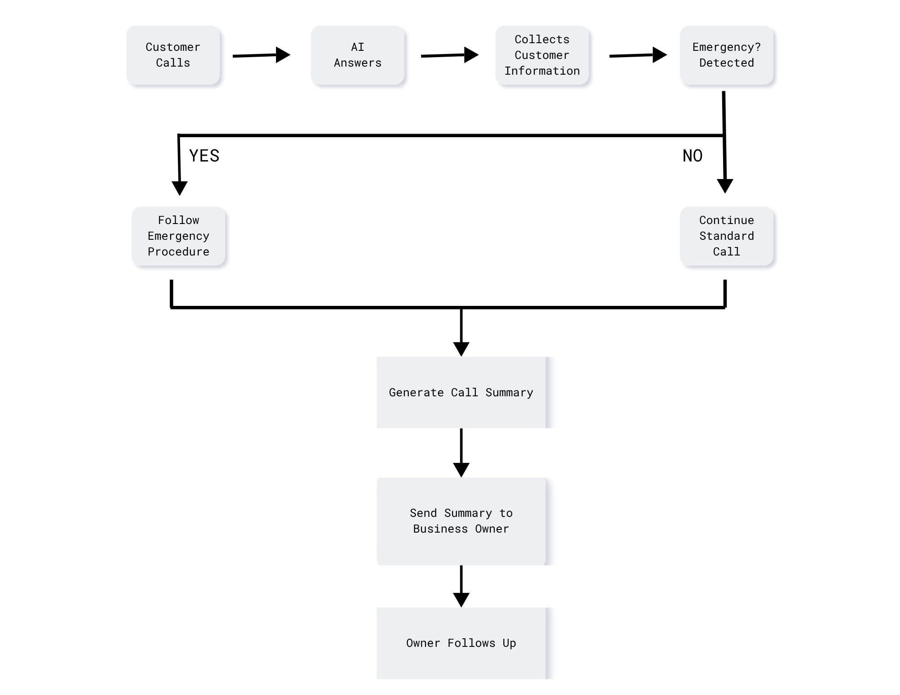
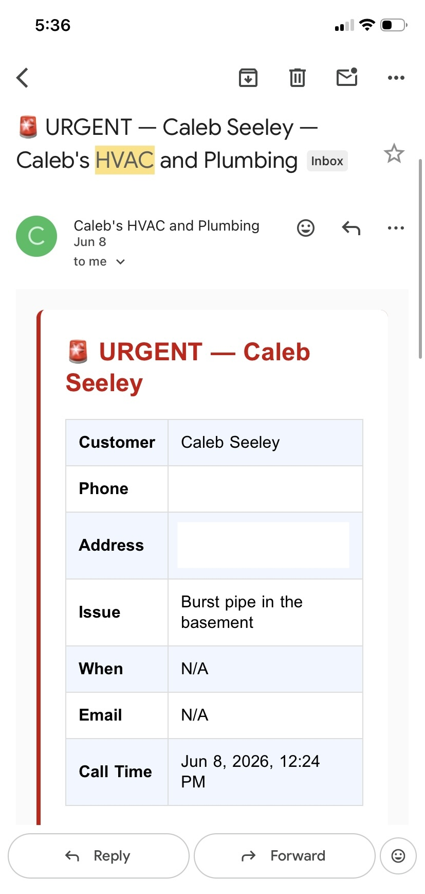
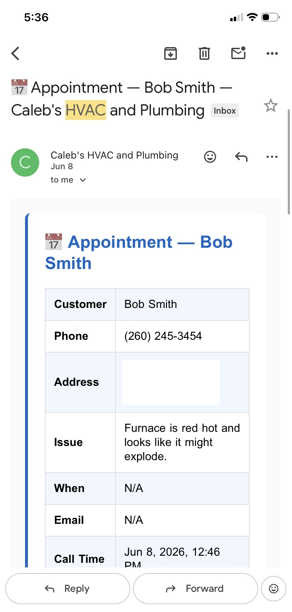
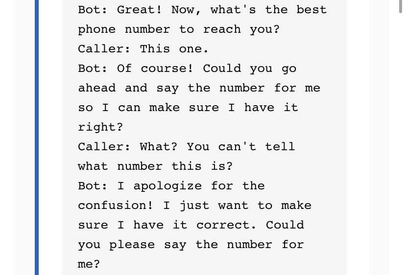

# Seely AI

## The Problem

Many HVAC and plumbing businesses depend on answering the phone quickly, even after normal business hours. Every unanswered call is a potential lost customer, but existing automated phone systems often leave customers frusterated instead of helping them.
## The Goal

This project explored whether AI could become a dependable first point of contact--one that could gather the right information, recognize urgent situations, and make it easier for business owners to follow up with confidence the next business day.
## The Approach

The system combined AI and voice technology to guide conversations, determine the customer’s needs, recognize urgent situations, and organize the information into a format business owners could quickly review and act on.
## System Overview

### Example: Emergency Call Summary

This is the structured summary delivered to the business owner after an urgent service call.

  

---

### Example: Routine Appointment Summary

This example shows how a routine appointment was organized into a clear, actionable follow-up.

  

---

### Example: Conversation Recovery

This example shows the AI recovering naturally after an unexpected customer response instead of repeating scripted prompts or failing.

  

## Technology Stack

- OpenAI
- Deepgram
- Twilio
- SendGrid
- Google Sheets
- JavaScript / Node.js
## Project Outcomes

The project successfully demonstrated that an AI system could:

- Answer after-hours customer calls.
- Collect structured customer information.
- Distinguish between emergency and standard calls.
- Generate business-ready call summaries.
- Deliver those summaries for next-day follow-up.

Although the project ultimately changed direction before being commercialized, it became the foundation for several ideas that shaped later projects, including Leo and a new approach to product validation.
## What We Learned

The most valuable lesson from this project wasn’t technical.

While the system successfully demonstrated what AI could do, we realized we had approached the project in the wrong order. We invested significant time building a solution before confirming that customers truly wanted it.

That experience fundamentally changed how we approach new ideas. Instead of building first and searching for customers later, we now begin by validating the problem, confirming there is genuine demand, and only then investing in a solution.

That shift in thinking has influenced every major project that followed.
